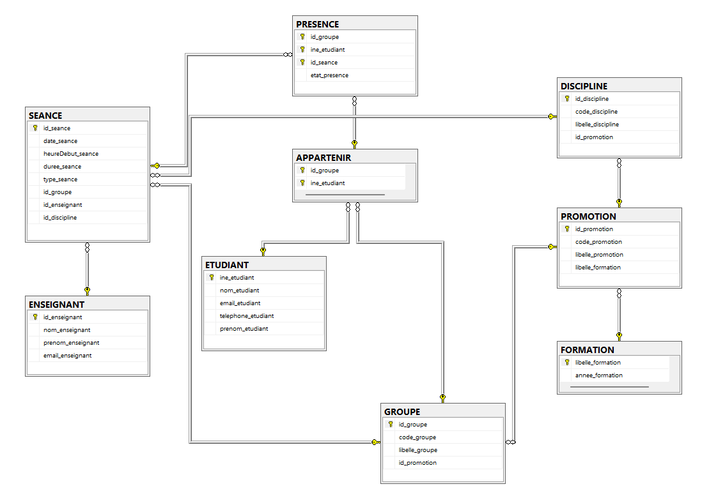
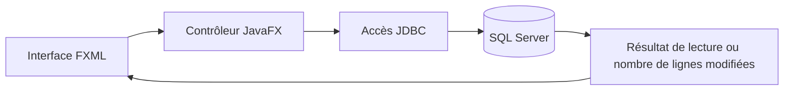
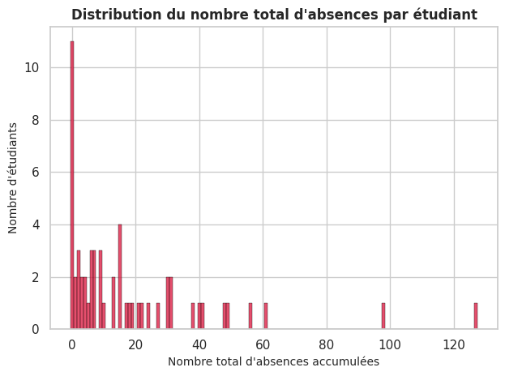
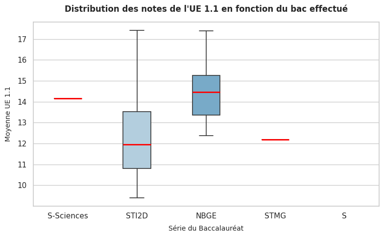

# 📊 Suivi des présences


**Concevoir une base relationnelle, enregistrer les présences depuis une application JavaFX et explorer les données avec Python.**

Ce projet couvre le parcours de la donnée : modélisation des étudiants, groupes et séances, définition des droits d'accès, consultation et mise à jour via JDBC, puis étude statistique de l'assiduité et des résultats académiques.

[Modélisation](docs/modelisation.pdf) · [Scripts SQL](sql) · [Notebook et graphiques](analyse/analyse-statistique.ipynb)

## 🎯 Fonctionnalités

- **Organiser les enseignements** : formations, promotions, groupes, disciplines et séances.
- **Gérer les appartenances** : un étudiant peut être inscrit dans plusieurs groupes.
- **Consulter un groupe** : afficher les identifiants, noms et prénoms de ses étudiants dans l'interface JavaFX.
- **Enregistrer un état de présence** : insérer un appel ou mettre à jour celui qui existe déjà.
- **Définir les droits SQL** de trois profils : enseignant, secrétariat et direction des études.
- **Explorer les données** : distributions, tableaux croisés, boîtes à moustaches et nuages de points dans un notebook Python.

L'interface est une preuve de concept centrée sur la consultation et la saisie. Les autres besoins sont illustrés par des requêtes SQL séparées.

## 🛠️ Technologies et outils

| Domaine | Technologies | Utilisation |
|---|---|---|
| Modélisation | Looping | Dictionnaire des données, dépendances fonctionnelles, MCD et MLD |
| Base relationnelle | SQL Server, T-SQL, SQL Server Management Studio | Tables, clés, jointures, vues et permissions |
| Application | Java, JavaFX, FXML, Scene Builder | Interface de connexion, consultation et saisie |
| Accès aux données | JDBC, pilote Microsoft SQL Server | Connexion et exécution des requêtes |
| Construction | Maven | Dépendances et lancement JavaFX |
| Analyse | Python, pandas, SciPy | Préparation des données et calculs statistiques |
| Visualisation | Jupyter, Seaborn, Matplotlib | Rapport exécutable et graphiques |

## 🗂️ Modèle relationnel

Le schéma comporte **neuf tables**. Les clés étrangères relient les séances à leur groupe, leur discipline et leur enseignant. Les tables d'association représentent les appartenances et les états de présence.



| Ensemble | Tables | Rôle |
|---|---|---|
| Organisation | `FORMATION`, `PROMOTION`, `GROUPE`, `DISCIPLINE` | Structurer les formations et les enseignements |
| Personnes | `ETUDIANT`, `ENSEIGNANT` | Référencer les participants |
| Planning | `SEANCE` | Décrire le créneau, le groupe et l'enseignement |
| Associations | `APPARTENIR`, `PRESENCE` | Relier les étudiants aux groupes et aux séances |

La clé primaire de `PRESENCE` porte sur le triplet `(id_groupe, ine_etudiant, id_seance)`. Une clé étrangère composée référence l'appartenance de l'étudiant au groupe.

Le [rapport de modélisation](docs/modelisation.pdf) détaille le dictionnaire, les dépendances fonctionnelles et les modèles. Le [fichier Looping](docs/modelisation.loo) permet de reprendre le modèle.

## 🔐 Rôles et requêtes SQL

| Profil | Lecture | Écriture |
|---|---|---|
| Enseignant | Ensemble des tables | Séances et présences |
| Secrétariat | Ensemble des données, dont formations et disciplines via des vues | Données hors formations et disciplines |
| Direction des études | Ensemble des données, dont formations via une vue | Données hors formations |

Les scripts illustrent notamment la liste des étudiants d'une séance, les appels manquants, la régularisation d'une absence, les inscriptions dans plusieurs groupes et le total de minutes manquées. Une requête produit également un résultat dénormalisé exportable en CSV depuis le client SQL.

Les rôles sont créés dans la base ; l'affectation des utilisateurs à ces rôles relève de la configuration SQL Server.

## 🖥️ Application JavaFX



L'interface propose trois zones : connexion, consultation d'un groupe et saisie d'un appel. La consultation joint `ETUDIANT` à `APPARTENIR`. La saisie retrouve le groupe de la séance et utilise `IF EXISTS` pour choisir entre `UPDATE` et `INSERT`.

Le projet réutilise un socle JavaFX/JDBC fourni comme point de départ, complété pour les besoins du suivi des présences.

## 📈 Analyse statistique

Le notebook consolide trois fichiers d'assiduité et les rapproche du fichier de résultats par `code_etu`. Les fichiers contiennent **1 017 enregistrements d'assiduité** et **57 lignes de résultats**. Ces volumes décrivent les fichiers sources ; ils ne signifient pas que chaque enregistrement correspond à une absence injustifiée.

La préparation utilise la concaténation des fichiers, le regroupement par étudiant, une jointure gauche, le traitement de valeurs manquantes et la conversion de moyennes au format numérique.

| Analyse | Variables |
|---|---|
| Distributions | Baccalauréat, avis de poursuite d'études, nombre de signalements, note d'UE |
| Tableau croisé | Baccalauréat × avis de poursuite d'études |
| Boîtes à moustaches | Notes selon le bac ; nombre de signalements selon l'avis |
| Nuages de points | Signalements × notes ; résultats entre deux semestres |





**Lecture des résultats.** La variable `nb_absences` compte les lignes d'assiduité associées à chaque étudiant : elle peut inclure des retards. Un avis de poursuite d'études est une appréciation, pas une mesure de l'envie de poursuivre. Les associations observées ne démontrent pas une causalité ; les catégories à très faible effectif demandent une interprétation prudente.

Les noms, prénoms et e-mails ont été remplacés. Les valeurs statistiques ont été conservées : il s'agit de données pseudonymisées, pas d'un jeu entièrement fictif.

## 👤 Ma contribution

J'ai assuré la réalisation principale du projet, de la conception de la base de données à l'application JavaFX et à l'analyse statistique.

- **Base de données** : dictionnaire des données, dépendances fonctionnelles, modèles MCD/MLD avec Looping, création et alimentation de la base SQL Server, rôles, vues, droits et requêtes métier.
- **Application JavaFX/JDBC** : réalisation des fonctionnalités de consultation des étudiants et de saisie des présences à partir du socle fourni.
- **Analyse Python** : réalisation de l'essentiel du notebook Jupyter, avec préparation des données, analyses statistiques, visualisations et interprétation des résultats.

Ce travail m'a permis de relier la conception d'une base relationnelle à son exploitation depuis une interface graphique, puis à l'analyse des données avec Python. Projet mené en binôme avec Célian Gloro.

## 🚀 Lancer le projet

### Base de données et application

Prévoir un **JDK 19 ou supérieur**, Maven (ou le wrapper fourni), et une instance **SQL Server** accessible en local. La compilation a été vérifiée avec OpenJDK 21 ; les échanges avec une instance SQL Server ne sont pas couverts par cette vérification.

1. Créer une base dédiée nommée `SAE_2_04` dans SQL Server.
2. Y exécuter `sql/01-creation.sql`, puis `sql/02-insertion.sql` et `sql/03-roles.sql`. Le premier script supprime les tables de même nom : utiliser une base de démonstration dédiée.
3. Configurer un compte SQL et l'associer au rôle souhaité dans la base.
4. Vérifier l'adresse de connexion dans `MyController.java` : `localhost:1433`, instance `SQLEXPRESS`, base `SAE_2_04`. Adapter ces paramètres à l'installation locale.
5. Depuis la racine du dépôt, lancer sous Windows :

```powershell
.\mvnw.cmd clean javafx:run
```

Avec Maven déjà installé :

```sh
mvn clean javafx:run
```

Saisir ensuite les identifiants du compte SQL dans l'interface. Le groupe `G_BUT1_TD11` permet de tester la consultation. La séance `S_BUT1_01` et l'étudiant `22005892` constituent un exemple de mise à jour avec le statut `Absence justifiée`.

`sql/04-requetes.sql` contient des exemples à exécuter séparément ; certaines instructions modifient les données.

### Notebook Python

Depuis la racine du dépôt, dans un environnement Python dédié :

```sh
python -m pip install -r analyse/requirements.txt
cd analyse
python -m jupyterlab
```

Ouvrir `analyse-statistique.ipynb` et exécuter les cellules dans l'ordre. Le dossier `sample_data/` doit se trouver à côté du notebook. Les graphiques enregistrés sont aussi consultables directement sur GitHub.

## 🔎 Limites et pistes d'amélioration

Le prototype utilise des requêtes construites par concaténation. Une évolution vers `PreparedStatement`, une validation des saisies et une gestion des erreurs améliorerait sa robustesse. Le champ de mot de passe est un `TextField` dans l'interface actuelle.

Les permissions définissent les opérations autorisées par table ; elles ne limitent pas les lignes aux seules séances de l'enseignant connecté. Des contrôles supplémentaires seraient nécessaires pour cette restriction. Les états de présence restent du texte libre dans le schéma actuel.

La connexion est prévue pour une démonstration locale (`trustServerCertificate=true`). Une utilisation déployée demanderait une configuration TLS appropriée et une gestion adaptée des comptes.

## 📁 Organisation

```text
src/                  Application JavaFX et accès JDBC
sql/                  Création, insertion, rôles et requêtes
analyse/              Notebook, dépendances Python et CSV
docs/                 Rapport, modèle Looping et illustrations
pom.xml               Configuration Maven
```

Projet réalisé dans le cadre du BUT Informatique à l'IUT de Laval.
